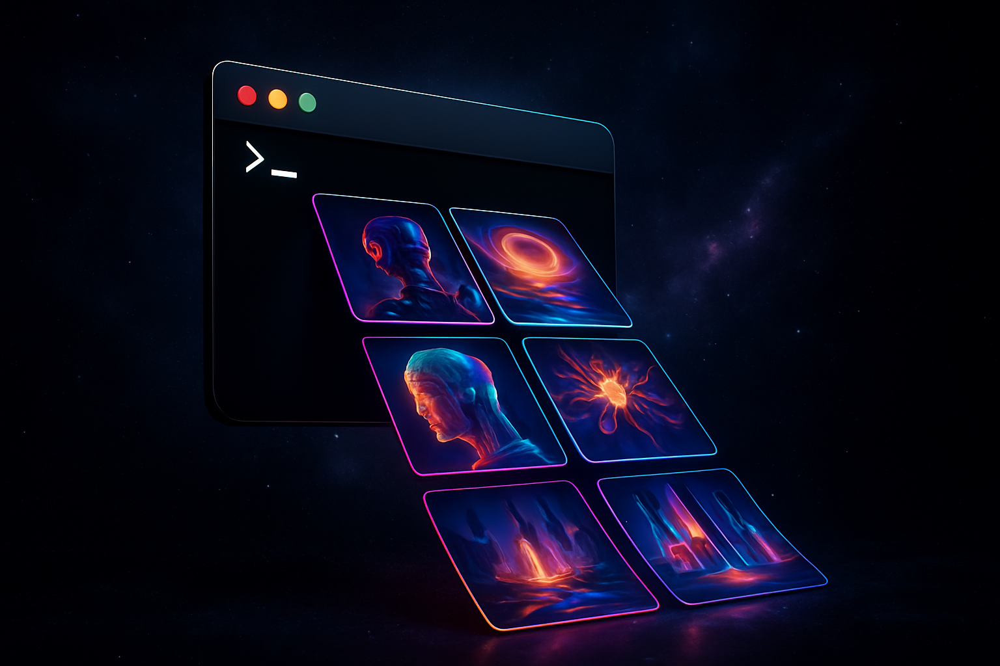

# generate-AI-images-cli



AI Image Generation CLI — generate images using Gemini, OpenAI, Flux, and more from your terminal.

## Installation

```bash
bun install
bun run build
```

To install globally as `generate`:
```bash
bun link
```

To use a different command name, edit `bin` in `package.json`:
```json
"bin": {
  "your-command-name": "./dist/cli.js"
}
```
Then run `bun link` again.

## Usage

```bash
generate "A serene mountain landscape at sunset"
# With flag
generate -p "A serene mountain landscape at sunset"
# Via stdin
echo "A serene mountain landscape at sunset" | generate
# Combine stdin + CLI (stdin as base prompt, CLI as refinement)
cat prompt.txt | generate "make it cyberpunk"
```

### Options

| Flag | Description |
|------|-------------|
| `-p, --prompt <text>` | Image generation prompt (alternative to positional argument) |
| `-m, --model <model>` | Model to use (default: `nano-banana-pro`) |
| `-a, --aspect-ratio <ratio>` | Aspect ratio: `1:1`, `16:9`, `9:16`, `4:3`, etc. (default: `16:9`) |
| `-s, --size <size>` | Image size: `1K`, `2K`, `4K`, or specific dimensions |
| `-o, --output <path>` | Output file path |
| `-r, --reference <path>` | Reference image(s) for style (repeatable) |
| `--transparent` | Enable transparent background |
| `--remove-bg` | Remove background after generation |
| `--add-bg <hex>` | Add background color to transparent image |
| `-n, --negative-prompt <text>` | Things to avoid in generation |
| `--thumbnail [size]` | Generate thumbnail (default: 256px) |
| `--variations <n>` | Generate N variations (1-10) |
| `--seed <number>` | Random seed for reproducibility |
| `--steps <number>` | Number of inference steps |
| `--guidance <number>` | Guidance scale |
| `-q, --quality <quality>` | Image quality: `standard`, `hd` |
| `--style <style>` | Image style: `vivid`, `natural` |
| `--num-images <number>` | Number of images to generate |
| `--api` | Use Gemini API instead of CLI for nanobanana models |
| `--list-models` | List all available models |

### Models

```bash
generate --list-models
```

**Google (Gemini/Imagen)**
- `nano-banana-pro` (default)
- `nano-banana`
- `imagen-4`
- `imagen-3`
- `imagen-3-fast`

**OpenAI**
- `gpt-image-1`
- `gpt-image-1.5`

**Replicate (Flux)**
- `flux`
- `flux-schnell`
- `flux-pro`

### Examples

```bash
# Generate with default model
generate "A serene mountain landscape at sunset"

# Generate with OpenAI in HD quality
generate -m gpt-image-1 "Abstract digital art" -q hd

# Generate with transparent background
generate -m gpt-image-1 "A cute robot mascot" --transparent

# Edit an existing image
generate -m gpt-image-1.5 "Add a hat to the person" -r ./photo.png

# Generate with cinematic aspect ratio
generate -m imagen-4 "Cinematic scene" -a 21:9

# Generate with reference image
generate -m flux "Same style as reference" -r ./reference.png

# Generate with multiple references (Gemini)
generate "Blend these styles" -r style1.png -r style2.png

# Generate 5 variations
generate "Abstract art" --variations 5 -o ~/Downloads/abstract.png

# Pipe from other tools
cat prompt.txt | generate
claude "describe a scene" | generate

# Combine stdin with CLI refinement
echo "A dragon" | generate "photorealistic, 8k, cinematic lighting"

# Use Gemini API instead of CLI for nanobanana
generate --api "A futuristic city" -m nano-banana
```

## Environment Variables

| Variable | Required for |
|----------|--------------|
| `GOOGLE_API_KEY` or `GEMINI_API_KEY` | Imagen models, or nanobanana with `--api` flag |
| `OPENAI_API_KEY` | GPT-Image models |
| `REPLICATE_API_TOKEN` | Flux models |
| `REMOVE_BG_API_KEY` | `--remove-bg` feature |

> **Note:** Nanobanana models (`nano-banana`, `nano-banana-pro`) use the Gemini CLI by default and do not require an API key. Pass `--api` to use the Gemini API directly instead.

## License

MIT
