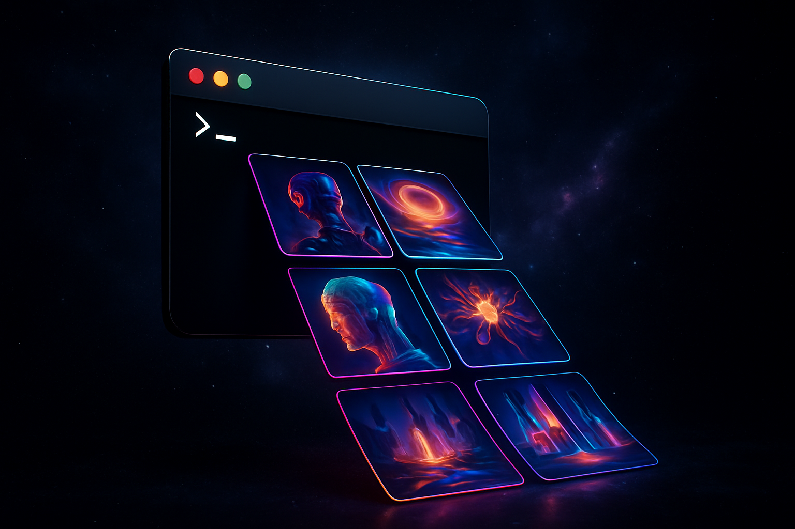

# Generate AI Images and Video



AI Image & Video Generation CLI — generate images and videos using Gemini (Nano Banana & Veo), OpenAI, Flux, and more directly from your terminal.

## Installation

```bash
bun install
bun run build
```

To install globally as `generate`:
```bash
bun link
```

To use a different command name, edit `bin` in `package.json`:
```json
"bin": {
  "your-command-name": "./dist/cli.js"
}
```
Then run `bun link` again.

## Usage

```bash
# Generate image with default model (nano-banana-2: Gemini 3.1 Flash Image)
generate "A serene mountain landscape at sunset"

# Generate video with Veo 3.1
generate -m veo-3.1 "A drone flying through a vibrant neon cyberpunk metropolis at night"

# With prompt flag
generate -p "A serene mountain landscape at sunset"

# Via stdin
echo "A serene mountain landscape at sunset" | generate

# Combine stdin + CLI (stdin as base prompt, CLI as refinement)
cat prompt.txt | generate "make it cyberpunk"
```

### Options

| Flag | Description |
|------|-------------|
| `-p, --prompt <text>` | Generation prompt (alternative to positional argument) |
| `-m, --model <model>` | Model to use (default: `nano-banana-2`) |
| `-a, --aspect-ratio <ratio>` | Aspect ratio: `1:1`, `16:9`, `9:16`, `4:3`, etc. (default: `16:9`) |
| `-s, --size <size>` | Image size: `1K`, `2K`, `4K`, or specific dimensions |
| `--resolution <res>` | Video/image resolution: `720p` or `1080p` for video; `1K`, `2K`, `4K` for image |
| `--duration <seconds>` | Video duration: `4` or `8` seconds (Veo models) |
| `--fps <number>` | Video frame rate (e.g. 24, 30) |
| `-o, --output <path>` | Output file path (`.png` for images, `.mp4` for videos) |
| `-r, --reference <path>` | Reference image(s) for style or image-to-video (repeatable) |
| `--transparent` | Enable transparent background |
| `--remove-bg` | Remove background after generation (images) |
| `--add-bg <hex>` | Add background color to transparent image |
| `-n, --negative-prompt <text>` | Things to avoid in generation |
| `--thumbnail [size]` | Generate thumbnail (default: 256px) |
| `--variations <n>` | Generate N variations (1-10) |
| `--seed <number>` | Random seed for reproducibility |
| `--steps <number>` | Number of inference steps |
| `--guidance <number>` | Guidance scale |
| `-q, --quality <quality>` | Image quality: `standard`, `hd` |
| `--style <style>` | Image style: `vivid`, `natural` |
| `--num-images <number>` | Number of images to generate |
| `--api` | Use Gemini API instead of CLI for nanobanana models |
| `--list-models` | List all available models |

### Models & Selection Guide

Use `generate --list-models` to view all available models from your terminal.

| Model | Type | Best For / When to Use | Key Strengths & Characteristics |
|-------|------|------------------------|---------------------------------|
| **`nano-banana-2`** *(default)* | Image | **Best overall default** for general generation, illustrations, artistic scenes, and realistic photos | Gemini 3.1 Flash Image. Up to 4K resolution, fast response, exceptional text rendering, and high consistency when combining reference images. |
| **`nano-banana-pro`** | Image | **Complex graphics, precise typography, product mockups, and intricate compositions** | Gemini 3 Pro Image. Studio-grade precision, deep multimodal reasoning, accurate layouts for technical/visual assets up to 4K. |
| **`nano-banana-2-lite`** | Image | **Ultra-fast ideation, UI prototyping, and high-volume batch generation** | Gemini 3.1 Flash Lite Image. Sub-2s latency, optimized for 1K resolution, highly responsive and cost-efficient. |
| **`nano-banana`** | Image | **Legacy workflows** requiring Gemini 2.5 compatibility | Gemini 2.5 Flash Image baseline model. |
| **`veo-3.1`** | Video | **Cinematic video generation, storytelling, and high-fidelity video production** | Google's premier cinematic video model. 720p/1080p, 16:9 landscape & 9:16 portrait, smooth camera motion, and image-to-video (`-r`). |
| **`veo-3.1-lite`** | Video | **Rapid video prototyping, social media clips, and quick animations** | High-efficiency video generator. Generates 4s clips in ~30s; perfect for fast iterations and mobile portrait videos. |
| **`gpt-image-2`** | Image | **Custom arbitrary dimensions and modern OpenAI generation** | Supports any WxH divisible by 16 (longest edge ≤ 3840px) and image-to-image editing. |
| **`gpt-image-1.5`** | Image | **Image editing and transformations via OpenAI** | Optimized for image-to-image editing using reference images (`-r`). |
| **`gpt-image-1`** | Image | **Standard OpenAI DALL-E style generation** | Reliable general generations with `--quality hd` and `--transparent` options. |
| **`gpt-image-1-mini`** | Image | **Fast, lightweight OpenAI generations** | Lower latency and cost for straightforward prompts. |
| **`flux-pro`** | Image | **Ultra-photorealistic portraits, skin textures, and artistic photography** | Top-tier photorealism, fine details, and natural lighting via Replicate. |
| **`flux`** | Image | **Balanced quality and style adherence** | FLUX 1.1 Pro quality with strong prompt comprehension via Replicate. |
| **`flux-schnell`** | Image | **Rapid drafting with minimal inference steps** | 4-step fast generation for quick previews via Replicate. |

> **Note on Retired Models:** `imagen-3`, `imagen-3-fast`, `imagen-4`, and `veo-2.0` were retired by Google and are automatically detected with clear migration guidance pointing to `nano-banana-2`, `nano-banana-pro`, or `veo-3.1`.


### Examples

```bash
# Generate image with default model (nano-banana-2)
generate "A serene mountain landscape at sunset"

# Highest quality graphic design with Gemini 3 Pro
generate -m nano-banana-pro "Intricate architectural cutaway of a futuristic space habitat"

# Ultra-fast sub-2s image generation
generate -m nano-banana-2-lite "Minimalist vector logo of a golden owl"

# Cinematic video generation with Veo 3.1
generate -m veo-3.1 "A drone flying smoothly through a vibrant neon cyberpunk metropolis at night"

# Mobile portrait video (9:16) with Veo 3.1 Lite
generate -m veo-3.1-lite "Raindrops rippling on a puddle in slow motion" -a 9:16

# Image-to-video animation with Veo 3.1
generate -m veo-3.1 "Bring this painting to life with gentle ambient wind and lighting" -r ./painting.png

# Generate with OpenAI in HD quality
generate -m gpt-image-1 "Abstract digital art" -q hd

# Generate with transparent background
generate -m gpt-image-1 "A cute robot mascot" --transparent

# Edit an existing image
generate -m gpt-image-1.5 "Add a hat to the person" -r ./photo.png

# Generate with reference image
generate -m flux "Same style as reference" -r ./reference.png

# Generate with multiple references (Gemini)
generate "Blend these styles" -r style1.png -r style2.png

# Generate 5 variations
generate "Abstract art" --variations 5 -o ~/Downloads/abstract.png

# Pipe from other tools
cat prompt.txt | generate
claude "describe a scene" | generate

# Combine stdin with CLI refinement
echo "A dragon" | generate "photorealistic, 8k, cinematic lighting"

# Use Gemini API directly instead of CLI for nanobanana
generate --api "A futuristic city" -m nano-banana-2
```

## Authentication & Keychain

`generate` automatically pulls credentials from the **macOS Keychain** if the corresponding environment variable is not explicitly set in your shell:

| Credential | Environment Variable | Keychain Service Name | Required for |
|------------|----------------------|-----------------------|--------------|
| Gemini / Google | `GOOGLE_API_KEY` or `GEMINI_API_KEY` | `GEMINI_API_KEY`, `GOOGLE_API_KEY`, `NANOBANANA_API_KEY` | Gemini Nano Banana and Veo video models |
| OpenAI | `OPENAI_API_KEY` | `OPENAI_API_KEY`, `OPENAI_PROJECT_API_KEY` | GPT-Image models |
| Replicate | `REPLICATE_API_TOKEN` | `REPLICATE_API_TOKEN`, `REPLICATE_API_KEY` | Flux models |
| Remove.bg | `REMOVE_BG_API_KEY` | `REMOVE_BG_API_KEY` | `--remove-bg` feature |

> **Note:** If an environment variable is set, it takes precedence. Otherwise, `generate` checks the macOS Keychain automatically. Nanobanana models use the local Gemini CLI extension by default if installed and do not require an API key unless `--api` is passed. Veo video models always use the Gemini API.

## License

MIT
