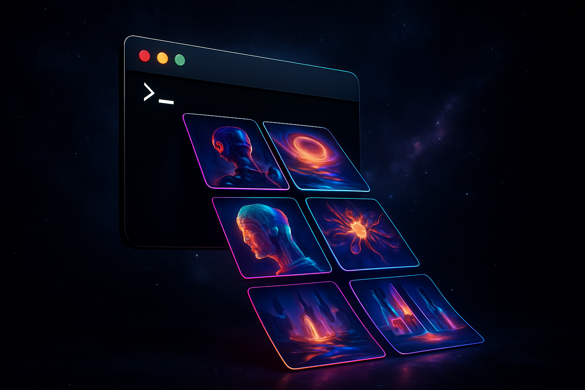

# Generate AI Images and Video



AI Image & Video Generation CLI: generate images and videos using Gemini (Nano Banana & Omni), Veo, OpenAI (GPT Image 2.5), Flux, and more directly from your terminal. Models are defined per provider in editable YAML config files.

## Installation

```bash
bun install
bun run build
```

To install globally as `generate`:
```bash
bun link
```

To use a different command name, edit `bin` in `package.json`:
```json
"bin": {
  "your-command-name": "./dist/cli.js"
}
```
Then run `bun link` again.

## Usage

```bash
# Generate image with default model (nano-banana-2.1: Nano Banana 2.1)
generate "A serene mountain landscape at sunset"

# Generate video with sound (Gemini Omni 1.1 Flash)
generate -m omni "A drone flying through a vibrant neon cyberpunk metropolis at night"

# With prompt flag
generate -p "A serene mountain landscape at sunset"

# Via stdin
echo "A serene mountain landscape at sunset" | generate

# Combine stdin + CLI (stdin as base prompt, CLI as refinement)
cat prompt.txt | generate "make it cyberpunk"
```

### Options

| Flag | Description |
|------|-------------|
| `-p, --prompt <text>` | Generation prompt (alternative to positional argument) |
| `-m, --model <model>` | Model to use (default: `nano-banana-2.1`) |
| `-a, --aspect-ratio <ratio>` | Aspect ratio: `1:1`, `16:9`, `9:16`, `4:3`, etc. (default: `16:9`) |
| `-s, --size <size>` | Image size: `512`, `1K`, `2K`, `4K`, or specific dimensions (WxH for OpenAI) |
| `--resolution <res>` | Video/image resolution: `360p` (Omni), `720p`, `1080p`, `4k` for video (Veo: 1080p/4k force 8s); `512`, `1K`, `2K`, `4K` for image |
| `--duration <seconds>` | Video duration: `3`-`10` seconds (Omni; default 8), `4`, `6`, or `8` (Veo) |
| `--fps <number>` | Video frame rate (e.g. 24, 30) |
| `-o, --output <path>` | Output file path (`.png` for images, `.mp4` for videos) |
| `-r, --reference <path>` | Reference image(s) for style or image-to-video (repeatable) |
| `--transparent` | Enable transparent background |
| `--remove-bg` | Remove background after generation (images) |
| `--add-bg <hex>` | Add background color to transparent image |
| `-n, --negative-prompt <text>` | Things to avoid (Gemini and FLUX fold this into the prompt text) |
| `--thumbnail [size]` | Generate thumbnail (default: 256px) |
| `--variations <n>` | Generate N variations (1-10) |
| `--seed <number>` | Random seed for reproducibility |
| `--steps <number>` | Number of inference steps |
| `--guidance <number>` | Guidance scale |
| `-q, --quality <quality>` | Image quality: `standard`, `hd`, `low`, `medium`, `high`, `xhigh`, `max`, `auto` (OpenAI; `xhigh`/`max` are GPT Image 2.5 only) |
| `--style <style>` | Image style: `vivid`, `natural` |
| `--num-images <number>` | Number of images to generate |
| `--api` | Use Gemini API instead of CLI for nanobanana models |
| `--list-models` | List all available models |

### Models & Selection Guide

Use `generate --list-models` to view all available models from your terminal.

| Model | Type | Best For / When to Use | Key Strengths & Characteristics |
|-------|------|------------------------|---------------------------------|
| **`nano-banana-2.1`** *(default)* | Image | **Best overall default** for general generation, illustrations, artistic scenes, and realistic photos | Nano Banana 2.1 (`gemini-nano-banana-2.1`). 1K to 4K output, exceptional text rendering, up to 14 reference images, about $0.034 per 1K image. |
| **`nano-banana-2`** | Image | *Deprecated by Google 2026-10-06 (no shutdown date yet)*; the only Gemini model with a `512` size | Gemini 3.1 Flash Image. 512 to 4K output. Use `nano-banana-2.1`. |
| **`nano-banana-pro`** | Image | **Complex graphics, precise typography, product mockups, and intricate compositions** | Gemini 3 Pro Image. Studio-grade precision, deep multimodal reasoning, accurate layouts for technical/visual assets up to 4K. |
| **`nano-banana-2-lite`** | Image | **Ultra-fast ideation, UI prototyping, and high-volume batch generation** | Gemini 3.1 Flash Lite Image. Sub-2s latency, optimized for 1K resolution, highly responsive and cost-efficient. |
| **`nano-banana`** | Image | *Deprecated (shutdown 2026-10-02)* | Gemini 2.5 Flash Image. Fixed ~1024px output. Use `nano-banana-2` or `nano-banana-2-lite`. |
| **`gemini-omni`** | Video | **Video with native sound on Google direct** | Gemini Omni 1.1 Flash (`gemini-omni-1.1-flash`). 3-10s, 16:9 or 9:16, 360p/720p (1080p/4k upscaled), image-to-video (`-r` is the first frame). Sound is always on; steer it in the prompt. No negative prompt. `--draft` renders at 360p. `--via atlas` adds start/end frames (`--ref start=`/`end=`), up to 10 references, and `--seed`. Aliases: `omni`, `omni-flash`. |
| **`veo-3.1`** | Video | **Cinematic video generation, storytelling, and high-fidelity video production** | Routes to Atlas (sound off unless `--param generate_audio=true`). 720p/1080p/4k, 16:9 or 9:16, 4-8s, start/end frames and identity refs. `--via google` works until Google shuts the preview id down on 2026-10-22. |
| **`veo-3.1-fast`** | Video | **Same features as Veo 3.1 with lower latency** | Routes to Atlas, as above. |
| **`veo-3.1-lite`** | Video | *Google direct only; shuts down 2026-10-22* | 720p/1080p, 4-8s. Use `gemini-omni` (`--draft` for cheap previews). |
| **`gpt-image-2.5-sunburst`** | Image | **Highest-quality OpenAI generation and precise editing / inpainting** | GPT Image 2.5 Sunburst. Any WxH divisible by 16 (longest edge ≤ 3840px, 0.65–8.3 MP), `xhigh`/`max` quality tiers, transparent backgrounds, reference-image editing (`-r`). Aliases: `sunburst`, `gpt-image-2.5`. |
| **`gpt-image-2.5-flare`** | Image | **Fast, high-quality everyday OpenAI generation** | GPT Image 2.5 Flare. Same sizes, quality tiers, and editing as Sunburst at lower latency. Alias: `flare`. |
| **`gpt-image-2`** | Image | **Previous OpenAI flagship; Batch API workloads** | Any WxH divisible by 16 (longest edge ≤ 3840px), `low`–`high` quality, image-to-image editing. |
| **`gpt-image-1.5`** | Image | *Deprecated (shutdown 2026-12-01)* | Fixed sizes only. Use a GPT Image 2.5 model. |
| **`gpt-image-1`** | Image | *Deprecated (shutdown 2026-10-23)* | Fixed sizes only. Use a GPT Image 2.5 model. |
| **`gpt-image-1-mini`** | Image | *Deprecated (shutdown 2026-12-01)* | Fixed sizes only. Use `gpt-image-2.5-flare`. |
| **`flux-2-pro`** | Image | **Current FLUX workhorse for generation and editing** | FLUX.2 Pro via Replicate. Up to 8 reference images (`-r`), 0.5 to 4 MP output, about $0.03 per 1 MP image. Alias: `flux-2`. |
| **`flux-2-max`** | Image | **Highest-fidelity FLUX output** | FLUX.2 Max. Same interface as Pro at higher quality and cost (about $0.07 per 1 MP image). |
| **`flux-2-flex`** | Image | **Typography and fine control** | FLUX.2 Flex. Exposes `--steps` and `--guidance`; up to 10 reference images. |
| **`flux-2-klein`** | Image | **Sub-second drafts and batch work** | FLUX.2 Klein 4B. Four-step distilled model, cheapest FLUX; up to 5 reference images. |
| **`flux`** | Image | **Previous-generation FLUX 1.1 Pro** | Still live on Replicate; Black Forest Labs lists it as legacy. |
| **`flux-dev`** | Image | **True image-to-image with `prompt_strength`, full `--steps`/`--guidance`** | FLUX.1 Dev open-weight model. |
| **`flux-schnell`** | Image | **Rapid drafting at minimal cost** | FLUX.1 Schnell, 4-step, about $0.003 per image. |
| **`flux-pro`** | Image | *Deprecated on Replicate* | Original FLUX.1 Pro. Use `flux` or `flux-2-pro`. |

> **Note on Retired Models:** the Imagen line, Veo 2.0, Veo 3.0, the `-preview` Nano Banana ids and `gemini-omni-flash-preview` (Google) and `dall-e-2`, `dall-e-3` (OpenAI) are retired. `generate` refuses them with a migration hint pointing at the current replacement.

### Model Configuration

Models are not hardcoded. Each provider has a YAML file under [`config/models/`](./config/models/) that declares its models, the API identifier to send, aliases, capability flags, deprecation notices, and retired-model redirects:

```
config/models/
├── google.yaml      # Nano Banana image + Gemini Omni and Veo video models
├── openai.yaml      # GPT Image models
└── replicate.yaml   # Flux models
```

To add or update a model, edit the relevant file; no rebuild is needed because the files are read at runtime. A minimal entry:

```yaml
models:
  gpt-image-2.5-flare:
    id: gpt-image-2.5-flare        # sent to the API (defaults to the key)
    kind: image                    # image | video
    description: Fastest GPT Image 2.5 model.
    aliases: [flare]
    edit: true                     # accepts -r reference images
    size_mode: flexible            # or fixed + sizes: [...]
    max_edge: 3840
    qualities: [low, medium, high, xhigh, max, auto]
```

Each file documents its provider-specific fields in a header comment. Set `GENERATE_MODELS_DIR=/path/to/dir` to load a different set of YAML files. `generate --list-models` shows which directory is in use.


### Examples

```bash
# Generate image with default model (nano-banana-2.1)
generate "A serene mountain landscape at sunset"

# Highest quality graphic design with Gemini 3 Pro
generate -m nano-banana-pro "Intricate architectural cutaway of a futuristic space habitat"

# Ultra-fast sub-2s image generation
generate -m nano-banana-2-lite "Minimalist vector logo of a golden owl"

# Video with native sound (Gemini Omni 1.1 Flash), 6 seconds
generate -m omni "A drone flying smoothly through a vibrant neon cyberpunk metropolis at night" --duration 6

# Mobile portrait video (9:16)
generate -m omni "Raindrops rippling on a puddle in slow motion" -a 9:16

# Image-to-video animation (the -r image is the first frame)
generate -m omni "Bring this painting to life with gentle ambient wind and lighting" -r ./painting.png

# Cinematic Veo 3.1 through Atlas, with sound
generate -m veo-3.1 "A slow dolly through a rain-soaked alley" --param generate_audio=true

# Highest-quality OpenAI generation (GPT Image 2.5 Sunburst)
generate -m gpt-image-2.5-sunburst "Abstract digital art" -q xhigh

# Fast OpenAI generation with transparent background (alias: flare)
generate -m flare "A cute robot mascot" --transparent

# Edit an existing image with OpenAI
generate -m gpt-image-2.5-sunburst "Add a hat to the person" -r ./photo.png

# Generate with reference images (FLUX.2 accepts up to 8)
generate -m flux-2-pro "Same style as reference" -r ./reference.png

# Generate with multiple references (Gemini)
generate "Blend these styles" -r style1.png -r style2.png

# Generate 5 variations
generate "Abstract art" --variations 5 -o ~/Downloads/abstract.png

# Pipe from other tools
cat prompt.txt | generate
claude "describe a scene" | generate

# Combine stdin with CLI refinement
echo "A dragon" | generate "photorealistic, 8k, cinematic lighting"

# Use Gemini API directly instead of CLI for nanobanana
generate --api "A futuristic city" -m nano-banana-2
```

## Providers, billing, and routing

One model name can be offered by several providers. `config/routing.yaml` says
which one serves it; `--via <provider>` picks another for one call.

| Provider | Billing | Notes |
|---|---|---|
| google, openai, replicate | metered | Direct APIs |
| atlas | metered | Reseller for image, video, and audio models; prices quoted with `--quote` |
| codex | plan | Codex `$imagegen`; draws on Codex plan limits; agentic and slower |
| agy | plan | Antigravity CLI; draws on the signed-in Google plan; agentic and slower |
| elevenlabs | metered | Speech in your own voices, dialogue, sound effects, music, video-to-music |

`--billing plan` never reaches a metered path, and `--billing metered` never
reaches a plan path; if no matching path exists the command fails and names
the alternatives. Video is always metered.

Atlas notes: Veo through Atlas is documented as audio off unless `--param generate_audio=true`,
but Veo 3.1 Standard is quoted with sound when the field is left out ($3.20 vs $1.60 for 8 s).
For a silent clip pass `--param generate_audio=false` explicitly. Gemini Omni has no audio
switch on either provider. Through Atlas, Omni defaults to 10 s when `--duration` is not given
(Google direct defaults to 8 s). The free `/calculate` endpoint sits behind an edge rate limit;
space out bulk price checks.

## Long jobs

Async jobs are recorded under `~/.cache/generate/jobs/` before the first poll.
If a job outlives `--wait` (defaults: image 120 s, video 600 s, audio 300 s),
`generate` exits 75 and prints `generate --resume <id>`. A submit is never
retried automatically, because a second submit is a second paid job.

## References

`--ref <role>=<path|url>` with roles `start`, `end`, `identity`, `style`,
`object`, `location`; `--ref-note <n>=<text>` says what the n-th one is for.
Each model's reference rules (counts, combinations that are not allowed,
durations they force) are checked before anything is sent.

## Exit codes

`0` done, `1` failed, `2` rejected before anything was sent, `75` still running.

## Authentication & Keychain

`generate` automatically pulls credentials from the **macOS Keychain** if the corresponding environment variable is not explicitly set in your shell:

| Credential | Environment Variable | Keychain Service Name | Required for |
|------------|----------------------|-----------------------|--------------|
| Gemini / Google | `GOOGLE_API_KEY` or `GEMINI_API_KEY` | `GEMINI_API_KEY`, `GOOGLE_API_KEY`, `NANOBANANA_API_KEY` | Gemini Nano Banana image and Gemini Omni / Veo video models |
| OpenAI | `OPENAI_API_KEY` | `OPENAI_API_KEY`, `OPENAI_PROJECT_API_KEY` | GPT-Image models |
| Replicate | `REPLICATE_API_TOKEN` | `REPLICATE_API_TOKEN`, `REPLICATE_API_KEY` | Flux models |
| Atlas Cloud | `ATLASCLOUD_API_KEY` | `ATLASCLOUD_API_KEY` | Atlas models (`--via atlas`) |
| ElevenLabs | `ELEVENLABS_API_KEY` | `ELEVENLABS_API_KEY` | ElevenLabs models (`eleven-*`, `--voices`) |
| Remove.bg | `REMOVE_BG_API_KEY` | `REMOVE_BG_API_KEY` | `--remove-bg` feature |

> **Note:** If an environment variable is set, it takes precedence. Otherwise, `generate` checks the macOS Keychain automatically. Nanobanana models use the local Gemini CLI extension by default if installed and do not require an API key unless `--api` is passed. Veo video models always use the Gemini API.

## License

MIT
